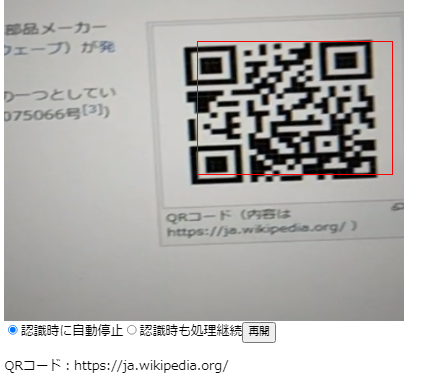

# QRコード認識Reactコンポーネント




* [サンプルページ(github pages)](https://murasuke.github.io/qr-reader-react/)

## はじめに

ブラウザでQRコードの認識できるのか？と調べたところ、[jsqr](https://www.npmjs.com/package/jsqr)というライブラリで簡単に出来ることがわかりました。
そのReact版です。

* 自作の[js-QR-reader](https://github.com/murasuke/js-QR-reader)をReactに移植

## 技術的な特徴

* カメラ動画を&lt;video&gt;タグでブラウザに表示。タイマーで定期的に画像化してQR認識ライブラリ[jsqr](https://www.npmjs.com/package/jsqr)に引き渡します。


* DOM(videoタグ)を直接操作する必要があるため`useRef()`フックを利用

* `setInterval()`で定期的に[QRコード認識ライブラリ](https://www.npmjs.com/package/jsqr)を呼び出します

* 認識時にcallBack関数で通知し、停止するかそのまま継続するか選ぶことができます。

## 主な機能

* props：&lt;video&gt;タグのサイズ、停止/再開(`pause`)、認識時枠表示(`showQRFrame`)を指定します

```typescript
export type QRReaderProps = {
  width?: number,
  height?: number,
  pause?: boolean,
  showQRFrame?: boolean,
  timerInterval?: number,
  onRecognizeCode?: (e: QRCode) => boolean,
}

```

* 認識したタイミングで、利用側にcallback(`onRecognizeCode()`)を行います。

```typescript
  const onRecognizeCode = (e: QRCode) => {
    setCode(e.data);
    if (stopOnRecognize) {
      setQRParam( e => { return {...e, pause: true}; });
    }
  }
```

## QR認識コンポーネント概要

一部を抜粋し、説明用に書き換えてあります。

1. &lt;video&gt;タグを配置し、ReactからDOMを直接操作するためuseRef()で参照します。

```typescript
  const video = useRef(null as HTMLVideoElement);
```

```typescript
  <video ref={video}></video>
```
  実際のソースでは、styled-componentを利用しているため、&lt;VideoArea&gt;になっています。

1. カメラの入力ストリームを取得し、videoタグに接続します。

```typescript
  const constraints = { 
    audio: false, 
    video: {
      facingMode: 'environment', 
      width, 
      height, 
  }};

  // useRef()を利用する場合、video.currentで参照します
  const stream = await navigator.mediaDevices.getUserMedia(constraints);
  video.current.srcObject = stream;
  video.current.play();
```

2. video動画を画像に変換するために必要なcanvas1を用意します。サイズはvideo側と合わせます。

```typescript
  const canvas = new OffscreenCanvas(width, height);
  const context = canvas.getContext('2d');
```

3. タイマー(`setInterval()`)を利用して定期的にQRコード認識処理を呼び出します。

```typescript
  timerId.current = setInterval(() => {
    // video動画から画像に変換
    context.drawImage(video.current, 0, 0, width, height);
    const imageData = context.getImageData(0, 0, width, height);
    // QR認識ライブラリに引き渡す
    const qr = jsqr(imageData.data, imageData.width, imageData.height);
  }
```

4. `qr`がnullでなければコードが認識されています。

* `qr.data`に読み取った値が入っています

* `qr.location`には、QRコードの位置が入っています。認識したコードを赤枠で囲うため`drawRect()`を呼び出して枠をオーバーレイ表示しています

* `props.onRecognizeCode`がnullでなければ、呼び出し元にコールバックします

```typescript
  if (qr) {
    console.log(qr.data);
    if (props.showQRFrame) {
      drawRect(qr.location.topLeftCorner, qr.location.bottomRightCorner);
    }
    if (props.onRecognizeCode) props.onRecognizeCode(qr);               
  }
```


## 利用方法

* コンポーネントのサイズと(width, height)と、読み取り状態(pause)に初期値をセットします。

```typescript
  const [qrParam, setQRParam] = useState({
    width: 500,
    height: 500,
    pause: true,
  });
```

* `onRecognizeCode()`で認識されたQRコードを取得し、読み取りを停止します。

```typescript
  const onRecognizeCode = (e: QRCode) => {
    setCode(e.data);
    if (stopOnRecognize) {
      setQRParam( e => { return {...e, pause: true}; });
    }
  }`
```

* `toggleVideoStream()`で停止と再開を切り替えます

```typescript
  const toggleVideoStream = () => {
    setQRParam( e => { return {...e, pause: !e.pause}; });
  }
```

```typescript
import React, { useState } from 'react';
import QRReader, { QRCode } from './QRReader';

function App() {
  const [stopOnRecognize, setStopOnRecognize] = React.useState(true);
  const [qrParam, setQRParam] = useState({
    width: 500,
    height: 500,
    pause: true,
  });

  const [code, setCode] = useState('');

  const onRecognizeCode = (e: QRCode) => {
    setCode(e.data);
    if (stopOnRecognize) {
      setQRParam( e => { return {...e, pause: true}; });
    }
  }

  const toggleVideoStream = () => {
    setQRParam( e => { return {...e, pause: !e.pause}; });
  }

  return (
    <div className="App">
      <QRReader {...qrParam} onRecognizeCode={onRecognizeCode} />
      <div>
        <label>
          <input type="radio" name="rdo" value="0" onChange={(e) => setStopOnRecognize(e.target.value === "0")} checked={stopOnRecognize} />認識時に自動停止
        </label>
        <label>
          <input type="radio" name="rdo" value="1" onChange={(e) => setStopOnRecognize(e.target.value === "0")} checked={!stopOnRecognize} />認識時も処理継続
        </label>
        
        <button onClick={toggleVideoStream}>{(qrParam.pause? '再開': '停止')}</button>
        <p>QRコード：{code}</p>
      </div>

    </div>
  );
}

export default App;

```